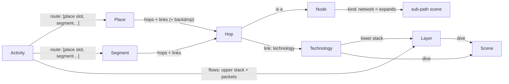

# Architecture

The app is an **engine** (`src/`) that knows nothing about phones, Wi‑Fi or fibre, and **content**
(`content/`) that is discovered by folder with `import.meta.glob`. New devices, technologies, layers, dives, places,
activities, languages and learn-more links are added as folders; no engine code changes. The laptop at the desk
(`content/nodes/laptop/` + `content/places/desk/`) was added that way, in a commit that touches only `content/`.
[authoring.md](authoring.md) walks through each kind of addition.

Stack and look and feel are decided in [visualisation-spikes.md](visualisation-spikes.md) (Svelte 5 + SVG + DOM text)
and [look-and-feel.md](look-and-feel.md) (Storybook, fly zoom, ease).

## The model

A reader is **somewhere** (a *place*: at home, on the go…) **doing something** (an *activity*:
watching a video…). Choosing both gives a **route**: a chain of hops (node instances) joined by links (each of one
technology). Every place works with every activity.



| Kind | Folder | Is |
|---|---|---|
| **Node** | `content/nodes/<id>/` | A device or place on the path (phone, router, cell tower, CDN…). `kind` is `device` or `network` (a group, like `internet`, that unfolds into its own path scene). Its default `role` (`endpoint`, `bridge`, `router`, `nat`, `passive`) decides which layers it opens and what it does to addresses; a `passive` node (an optical splitter) reads nothing and has no layer dives, so the frames and their readers carry on through it. Art: `art/Device.svelte`. |
| **Technology** | `content/technologies/<id>/` | What a link is made of (Wi‑Fi, Ethernet, GPON, 5G NR…). Its **lower layer stack**, a `look` (`radio`, `cable`, `fibre`, `trunk`: the theme draws each look), a colour, and optionally the **dive** scene that explains it. |
| **Layer** | `content/layers/<id>/` | One envelope in a packet: HTTP, TLS, TCP, IP, Wi‑Fi, Ethernet, GPON, MPLS, VLAN, NR, GTP. Its **header schema** (`fields`: id, bits, value template, which roles use it) drives the packet model and the peek (below). `openAt` lists the roles that read it (TCP: only endpoints), `seals` makes it encrypt what's inside, and `dive` names the layer dive scene behind its magnifier. Issues #5, #8, #17. |
| **Scene** | `content/scenes/<id>/` | A "look inside" dive: `Scene.svelte` plus its own art and maths. It `explains` a **link**: the physical signal (`wifi-radio`, `copper-pulses`, `fibre-light`, `nr-radio`), a **device** (`node`, issue #9): what's inside it and how it turns one medium into the next (`router-inside`, `tower-inside`, the border router's `border-inside` with its route book choosing the exchange over transit, the exchange's `ixp-inside` with its shared switch and route server, the data centre's `leaf-spine` (2010's `three-tier`: core, aggregation and access, spanning tree blocking the standby's uplinks) and `server-inside`, which opens 1995's tower web server and 2010's bare-metal cache too), a **circuit** (`tdm-frames`: the timeslots of 1995's E1s, T1s and the PRI, sharing its slot row with `modem-call`), or a **layer at one hop**: the envelope (`ip-post`, `tcp-pieces`, `tls-lock`, `http-chunk`, `gtp-tunnel`, and for the link layers `wifi-frame`, `sticker-doors`, `gpon-slots`, `nr-grant`, and 1995's `atm-cells`, with `ppp-hello`'s HDLC keepalives for a leased line). It gets a `subject` (below), so one scene serves several technologies (the fibre dive draws a street's shared PON thread with its splitter on the access fibre, DWDM colours on metro fibre, the exchange's short cross-connects and the data centre's CWDM links (2010's 10GBASE-SR in one colour), boosters every 80 km on the backbone and repeaters on the sea floor under the `submarine` cable, both spaced from the stretch's real `km`), several layers (`sticker-doors` is Ethernet's door book, VLAN's coloured lanes and MPLS's motorway numbers), or every hop (the IP dive is a signpost at a router, a swap notebook at a NAT, carrier-grade NAT at the mobile core). |
| **Segment** | `content/segments/<id>/` | A reusable stretch of route (`isp-to-cdn`: ISP core → border router → IXP → CDN, with transit as a dashed side branch off the border router). Hops, links, side branches, per-hop overrides and layout. A segment with `variantOf` and an `era` stands in for its base in that era (#59). |
| **Place** | `content/places/<id>/` | A segment that starts at the reader's device and joins the shared network, plus a backdrop (`art/Backdrop.svelte`: the house, the street), an `order` in the picker and, on a base place, a `picture` there (a node of kind `place`: the house, a phone on the move). A place with `variantOf` is another way online from the same place (`desk`, `home-fttb`, `home-dsl`, `home-dialup` from home): the picker shows the base once, with its picture, and a row of `access` chips, of the era you are in. A place may have an `era`. |
| **Era** | `content/eras/<id>/` | A time the internet at home looked different (`1995`, `2010`, `today`; issue #59): a `year`, a `name`, the `kid`/`nerd` text the time machine shows, and a `describe` of its picture (the era's start device). Every place gets the time machine: an era switch is a place switch to the family member of that era, else to the era's own trip (`eraStops`). |
| **Activity** | `content/activities/<id>/` | What happens: the **flows** (upper stack `ip › tcp › tls › http`, and packet kinds with direction, pace and colour) and the **route** (`[{ place: 'me' }, { segment: 'isp-to-cdn' }]`), plus which network nodes expand (a group may be drawn by another network node: `{ id, node }`). An activity with `variantOf` and an `era` stands in for its base in that era (#59: `watch-video-1995` opens a web page over plain HTTP); the URL names the base. |
| **Owner** | `content/owners/<id>/` | Who runs a hop: your ISP, the exchange, the video company, a transit carrier (issue #20). Hops say `owner`; inside a group, each owner's hops become a tinted region with a sign, so the internet reads as a network of networks. |
| **Locale** | `content/locales/<lang>/` | `meta.json` (`name`, `dir`) and `ui.json` (chrome strings). Every other folder carries its own `locales/<lang>.json`. |
| **Theme** | `content/themes/<id>/` | The visual style (`?style=<id>`): tokens, motion, sound, and the engine's art slots (below). A theme may have a night mode (`?mode=night`). |

Designed in, but used by only one item so far:
- **Instances.** A hop is `{ at: <instance>, node?: <node> }`, so a route can hold two routers (messaging, later).
- **Several place slots per route.** Messaging would have `me` and `friend`, each optionally restricted with `only`.
- **Several flows per activity.** Each flow has its own upper stack and packet kinds (DNS before the video, a P2P call).
- **Per-link overrides:**
  - `stack` (the gNB → mobile core link adds a `gtp` tunnel)
  - `dive` (a different scene, or `false` for none)
  - `role`, `addr` and `natTo` per hop

### How future ideas map onto it

Bigger ones get a plan first, in [plans/](plans/README.md).

| Idea | What to add |
|---|---|
| Issue #3: xDSL, FTTB, dial-up | A **place variant** of `home` (`variantOf`) per way online, with a new **technology** and, if it deserves one, a **scene**. Done: FTTH/XGS-PON (`home`), xDSL (`home-dsl`: `vdsl` to a `dslam`, the `dsl-tones` dive with its frequency bands and distance), FTTB (`home-fttb`: a riser to the `building-switch`, then `fttb` fibre, the fibre dive's building mode), dial-up (`home-dialup`: the `laptop` calls over `dialup` through the telephone `exchange` to the ISP's modems; the `modem-call` dive plays the handshake, and the `ppp` **layer** has its `ppp-hello` dive). Cable (`docsis`) would be one more variant. |
| Issue #59: a time machine | An **era** on each place variant; the switch picks the family member (`placeFamily`) of that era, and the route, URL and dives follow as for any place. Done: the eras 1995, 2010 and today on the home family, each with its start device (a PC, a laptop on Wi‑Fi, a phone); 2010 on the go (a phone on 3G: NodeB, RNC, a Direct Tunnel to the GGSN, the SGSN aside; `nr-radio` and `nr-grant` have a 3G mode) and at home on a cable (`desk-2010`: a laptop on a cable to the DSL router's 100 Mbit/s port, `fast-ethernet`: `copper-pulses` draws 100BASE-TX's MLT-3); the time machine's button in the top bar on every screen, its 🕰️ chip in the caption on every overview, its coach card, and its lazy panel (`ui/TimeMachine.svelte`); from a place with no member in an era, the era's own trip; 1995 on the go (`on-the-go-1995`, #147): a laptop with a GSM phone on a 9.6 kbit/s circuit-switched data call, BTS, BSC and MSC (`gsm`, `abis` and `trunk` links; `nr-radio` has a GSM mode, `tdm-frames` Abis and trunk modes), the MSC's IWF dialling the ISP's modem bank over the PSTN, then 1995's internet; 1995's internet (`isp-to-cdn-1995`, step 6): a PRI into the ISP's modem bank, 10BASE-T in its rack, a leased E1 to its upstream (DIX as the aside), CANTAT-3, an American ATM backbone and a T1, with the `tdm-frames` and `atm-cells` dives; 1995's server room (`datacentre-1995`, step 7), drawn by the `server-room` group node: the site's router, a 10BASE-T hub and one beige tower web server, whose dive is `server-inside`'s tower mode (one program, one disk) and whose HTTP dive is `http-chunk`'s page mode (GET /index.html, then the picture); 2010's internet is today's with 2010's numbers, and its data centre (`datacentre-2010`, step 8) a rented cage in a colocation centre further away, drawn by the `colocation` group node: the core router, a load-balancing appliance, an `aggregation` switch (the `three-tier` dive) and the rack's access switch, 10G fibre between them (one colour, 10GBASE-SR, in `fibre-light`) and 1G copper to a bare-metal cache (`server-inside`'s 2010 words: no VMs or k8s, a NIC 2×1G, hard disks). Plan, with what comes next: [plans/59-time-machine.md](plans/59-time-machine.md). |
| Issue #2: IoT, LoRaWAN | A **node** (`sensor`, `lora-gateway`, `network-server`), a **technology** `lorawan` (look `radio`) with a `lorawan` **layer** and a `chirp` dive **scene**, a **place** (`garden`, `field`), and an **activity** such as `send-reading` with a small upward flow. `only` keeps it to places that make sense. Plan: [plans/2-iot-lorawan.md](plans/2-iot-lorawan.md). |
| Messaging | An activity with two place slots (`me`, `friend`) around a `messaging-server` segment, and an `e2ee` layer that the server can't open (`openAt: ['endpoint']`). |
| Video call (P2P, WebRTC) | A second flow on a direct path, with the NAT traversal shown on the routers (`role: 'nat'`). |
| Airplane, Starlink | A place `airplane` with the technologies `satellite` and `aircraft-wifi`. Packet pace per link shows the latency. |
| DNS, cache miss, rerouting | A preceding flow (DNS); an `origin` segment behind the CDN; an aside that becomes the path (transit). |

## Folder layout

```
index.html
src/                      the engine: no content ids anywhere
  api.ts                  the only module Svelte content imports ($core/api)
  define.ts               defineNode/defineTechnology/… for definition files ($core/define; types only)
  main.ts App.svelte state.svelte.ts router.ts
  engine/                 camera (semantic zoom), gestures, motion, packets, sound, speech (read aloud), svg, geometry,
                          zoom
  model/                  registry (content globs), strings, schema + validate (zod),
                          resolve (route), layout (path scenes), tree (scene tree), packet (the packet model),
                          stack (LayerCtx), ladder (what lies below a scene), location (URL), regions (owner outlines),
                          trip (km, light, owners), describe (the keys a scene's text and description are under),
                          focus (a scene's spots: the keys' and the list view's), textmap (the scene tree as a list)
  render/                 World (camera + recursive scenes), SceneView, PathScene, Node, Depth, Text, TagAt,
                          lazy (the Svelte content loaded on demand: device art, backdrops, dives, era flavour),
                          Arrive (fades in a backdrop that lands late),
                          art-base/ (fallback art slots), theme-types (the theme contract)
  ui/                     Chrome (explore, pause, level, day/night, mute, ⋯), Menu (⋯: language, sound, read aloud, style,
                          list view, About), About, Ladder (breadcrumb), Caption, PeekPanel, Envelope, FieldTree,
                          Change (a changed value), Announcer + announce (what a screen reader hears), SceneKeys (the
                          keyboard in the scene), TextMap (the list view), CoachMarks + coach, coach-marks (the
                          first-run coach marks), TimeMachine (the eras of where you are, #59)…
content/
  locales/{en,da}/        meta.json ui.json
  themes/storybook/       theme.ts tokens.css meta.json art/*.svelte
  nodes/<id>/             node.ts  art/Device.svelte  locales/<lang>.json
  technologies/<id>/      technology.ts  locales/
  layers/<id>/            layer.ts  locales/
  scenes/<id>/            scene.ts  Scene.svelte  art/  *.ts (scene maths)  locales/
  segments/<id>/          segment.ts  locales/
  owners/<id>/            owner.ts  locales/
  places/<id>/            place.ts  art/Backdrop.svelte  locales/
  eras/<id>/              era.ts  locales/
  activities/<id>/        activity.ts  locales/
```

Import rules keep this honest (checked by `src/model/content.test.ts`):
- Content `.ts` files import only `$core/define` (types) and relative files.
- Content `.svelte` files import only `$core/api` and relative files.
- The engine never names a content id.

## From URL to pixels

```
#/<lang>/<place>[+<place>…]/<activity>/<step>/<step>…/@<stop>     ?level=technical  ?style=<theme>  ?mode=day|night  ?sound=on|off
#/da/on-the-go/watch-video/internet/@mobile-core
#/en/home/watch-video/internet/home-cabinet                         (three levels: the access fibre)
#/en/home/watch-video/router~ip                                     (a layer dive: IP at the home router)
#/da/on-the-go/watch-video/internet/mobile-core~ip                     (IP at the mobile core: carrier-grade NAT)
```

1. **Location** (`model/location.ts`, `router.ts`). The hash is parsed into `{ lang, places, activity, path, stop }`.
   - Changing a scene or place pushes a history entry, so Back undoes a place switch. Changing the stop or the language replaces the entry.
   - A path that no longer exists falls back to its longest valid prefix. For example, after switching to the street, the Wi‑Fi dive becomes the overview, and `internet/home-cabinet` becomes `internet`. A layer dive survives a place switch when its hop is in both routes (`phone~tcp`); `router~ip` on the street becomes the overview.
2. **Route** (`model/resolve.ts`). The activity's route steps are filled with the chosen places and segments and joined into one chain of hops and links. Each hop gets its node, role, address and group. Each link gets its technology, stack, dive and colour. The route also records which folder each part came from, so strings can be looked up from the most specific source.
3. **Path scenes** (`model/layout.ts`). The root scene shows the hops outside any group, and each group collapses into one node. Expanding a group shows the hops inside it, with an *entry* node that stands for "where you came from" (the house, or the cell tower). Groups nest (an activity lists `{ id, in }`): a group inside another is one node in its parent's scene, and its own scene's entry is the hop just before it (the data centre is entered from the exchange). A network node may bring its own backdrop (`content/nodes/<id>/art/Backdrop.svelte`), drawn over the theme's in its unfolded scene.
   - Placement comes from the place, segment and activity `layout`, per orientation. Unplaced nodes are spread along the spine.
   - Links are routed from their end nodes, with a `bend` or a hand-drawn `curve`.
4. **Scene tree** (`model/tree.ts`).
   - A path scene's children, in route order, are its expandable groups, its links that have a dive, its **device dives** (issue #9: a device on the chain whose node has a `dive`; the step is the hop id, `home/watch-video/router`), and its **layer dives**: for every hop drawn in the scene (not groups, entries or asides), every layer with a `dive` on the links arriving at it. The step is `<hop>~<layer>`.
   - A layer dive's subject is that hop's `LayerCtx`, in a canonical direction (the way the layer arrives upwards if it does, else downwards: the NAT sees the request go out, the phone the video come in), so the URL needs no direction. The scenes show the round trip anyway.
   - A child sits at `DETAIL_SCALE` inside its anchor (the node, or the link's midpoint), to any depth. A hop's layer panels form a **vertical stack** centred on the node, lower layers below, so the stack reads top to bottom (stepping between them slides in place, see *Camera*). On a device with a dive of its own, that dive sits on the device (like a group's scene) and the layer stack sits all above it, as upper floors.
   - `layerPath(route, hop, layer)` finds the scene in which a hop is drawn, so tapping IP in the peek at the root, for a packet at the OLT, flies to `internet/olt~ip`.
   - **All the way down (issue #13).** Every link has a dive (its signal) and so does every layer in its lower stack
     (its envelope); a content test checks this for every place × activity. `downFrom(route, ref)` goes from a link
     layer's dive to its link's dive (next to it when that scene draws the link: `internet/olt~gpon` →
     `internet/home-cabinet`, the PON's stretch through the passive splitter); `upFrom(route, ref)` goes from a link dive to the dives of its link's layers (at the end
     drawn beside it, else the one receiving them going up), and from a device dive to the dives of the layers of the links either side, at that device (the router: its Ethernet and XGS-PON envelopes); `linkOut` is the link a caught packet's outer envelopes
     belong to. They become the caption's **How it travels** / **What it carries** chips and the peek's bottom row.
   - Each mounted scene gets one flat transform from the root, computed in JS doubles, so three levels deep (1000×) stays sharp. Only the scenes along the flight and their near children are mounted. A mounted scene at alpha 0 (the root under a dive, a flight's destination before it fades in) is not drawn, and it holds its camera and clock (`held`, `render/held.svelte.ts`, #181): its art, text and dives get the scene's `time` (`SceneCtx.time`, a dive's `time` prop), not `view.time`, so nothing in it is written again until it shows.
5. **Camera** (`engine/camera.ts`, `engine/zoom.ts`). Fly zoom and semantic zoom (pinch or scroll into a child and it opens; out, and it closes) work on the current scene, its parent and its children, never on hard-coded ids.
   - Pinching or scrolling in opens the child that fills enough of the view nearest its centre (`decide`), so a device's dive and the link dives either side of it don't compete: whichever you zoom at wins. Standing at a device's stop leaves its dive shut; zoom in further to open it.
   - Layer dives are only reached by address (the peek, the URL, stepping), never discovered by pinching into a node: `mixes` and `decide` skip layer children that aren't on the current path, so pinching into a router still does what it did.
   - **One panel at a time around a device (issue #9).** A device's dive sits between the dives of the links either side, so near it two or three panels would show at once (untidy, and at 6× CPU the second panel's text cost frames). `mixes` ends with a *crowd* fade: of a device dive and its sibling dives, the one nearer the view centre fades the others (and their children) out as it shows itself (`CROWD` in `engine/zoom.ts`). It depends only on the camera, not on the path, so nothing pops when `decide` changes path mid-pinch. Two link dives whose panels overlap (close links on a phone: the two fibres of the block of flats, #136) crowd each other the same way; other levels are untouched (`zoom.test.ts` checks that in every dive no overlapping sibling shows).
   - **Walking the whole trip (issue #169).** In a path scene ◀ ▶ (and the arrow keys and a flick) don't stop at its ends: `walkStep` (`model/tree.ts`) walks every stop of every path scene in route order, a group's stops in its place. The step that would land on a group goes in, to its first stop (▶) or, from the stop after it, its last (◀); past either end of a group's stops it steps back out, to the stop after or before the group. Only the root's overview (◀ from the sender goes there first) and the server bump. On a group (tapped) or in a group's scene as a whole, ▶ goes to its first stop and ◀ to the stop before it. A crossing uses the flights a door or Esc would (a `go` with a path), and the button names it: "Into: <the group>", "Back out: <the entry>" (or the exit, going on), from the scene's `entry`/`exit` node (`nav.in`, `nav.out`). The walk is tested over every place × activity × orientation (`model/walk.test.ts`) and in the a11y pass (▶ to the server and back on desktop and phone). Dives keep their own stepping and bumps.
   - Sideways stepping (`sideways` in `model/tree.ts`) walks the stops of a path scene, the sibling link and device dives in route order (Wi‑Fi ↔ copper ↔ the home router ↔ fibre at home; 5G ↔ the cell tower ↔ fibre on the street; issue #38), or, in a layer dive, the layers carried on the link you're on at that hop, in stack order (▲/▼, a vertical flick, the arrow keys: the depth ladder's rungs, below); ▼ from the lowest goes on down to that link's signal (the ladder's bottom rung).
   - **Stretches (issue #34).** At dive level a sideways stop is a *run* of consecutive sibling link dives into the same scene with the same technology: the three backbone links inside the internet are one "backbone" stop, not three identical dives. The key is (dive scene, technology) because that is already what makes a dive different (its subject, its `scene.<id>.<tech>` title and captions); the scene alone would merge access, metro and backbone fibre, and adding the layer stack would split the backbone in two (MPLS vs plain Ethernet) for the same picture. It lives in the engine, so it needs no authoring and holds for every place; a link that should be its own stop gets its own technology or `dive`. A run is **one child dive** of the path scene (`diveRuns`): its step (and URL) is its first link, it has one magnifier badge, on one of its links as near the run's middle as it can be while clear of every device and its name at the biggest they are drawn (`doors.ts`: names are measured in the current language and allowed to grow to 1.7× on a phone and 1.9× in short landscape, as they do at rest; the whole-run glow shows what it covers), and tapping any of its links, or pinching into any of them, opens it; the other links of the run are not steps of their own (an old URL naming one falls back to the parent). Stepping then moves one place at a time everywhere, and the travel into or out of a run lands at its middle, gliding past the devices inside it. Its caption says what it stands for under the title ("2 stretches · via Backhaul switch", the device names joined with the language's `Intl.ListFormat`).
   - **Devices between links (issue #38).** A device with a dive of its own is a sideways stop between the links either side, so stepping goes link → device → link. It also **ends a run**: two same-technology links either side of it are two stops, each side of the device, because the reader should be able to stop at the device and a stretch "via" a device you can look inside would hide it. Devices without a dive stay inside runs, passed on the glide as before (the backhaul switch inside the metro fibre). With today's content one run is split: the exchange sits between two cross-connects (from the border router, and on into the data centre), so they are two stops either side of the exchange's dive. The home router and the cell tower sit between different technologies.
   - **Sideways travel (issue #36).** Between two sibling dives (of links or devices) of one path scene (`travelOf`, from the previous and next paths in `onNav`, so Back/Forward and URL edits travel too) the camera doesn't fly straight across: it zooms out to `travelK`, glides along the path, and zooms into the next dive, as three overlapping legs of one move (`travelInterpolator` in `engine/camera.ts`).
     - `travelK` is as deep into the parent as the camera can be before any dive panel starts to fade in (`TRAVEL.u` = 0.4, just under `FADE_IN` in `engine/zoom.ts`, which `mixes` uses), so the reader sees the devices and links in between, never a half-faded dive.
     - The legs (`TRAVEL`): out about 650 ms and in about 700 ms (scaled by how far the zoom changes), eased with a sine ease-in-out on log zoom; each leg overlaps the next by 15 %, so out, glide and in each read. The theme's `motion.speed` scales it all.
     - The glide is slow on purpose: the reader should see where they go from and to, and what's in between. It takes at least 2 s, 0.6 s more for each further device it passes (or 0.8 s per screen width at `travelK`, if longer), up to 4 s. A step between neighbours takes about 3 s. These values were tuned by eye with the user on PR #37.
     - The glide follows the chain as one curve (`chainOf`: the start device, each link's bezier, a curve through each device's centre, the end device). A link sits at its midpoint on it, which is exactly its dive's anchor. As the view centre passes each item, the focus highlight moves to it (link glow → device ring → link glow).
     - Time along it is warped (`chainWarp`): it slows to 35 % speed within 0.25 screens of each device, where the medium changes, and moves on along the plain stretches of link.
     - Passing a device between links of different technologies, a small pill beside it names the change ("Wi‑Fi → Cable", from the technologies' own names, so en + da come for free); it fades in and out with the distance and goes as the camera zooms into the next dive. While the caption is hidden, a pill in its place says where from and to (the two dives' titles; the one we're nearer is lit, switching half way). Both are DOM over the stage, without backdrop blur.
     - A step that arrives mid-travel re-plans from the current camera: it continues from the current point on the chain at its current speed (a Hermite start slope), with no snap and no stop. Held arrow keys or quick flicks become one glide, at `chained` (75 %) of a single step's glide time so a double step doesn't drag, and the from → to pill keeps the dive the glide set off from; a normal flight still snaps to its end first. Otherwise (at rest, or after a drag stopped the camera mid-glide) it sets off from the camera centre's nearest point on the chain (`chainNear`), so it never heads back to an abandoned target first.
     - Any navigation ends a wheel or touch gesture still in progress (`interrupt()` from `attachGestures`): a trackpad's momentum scroll still arriving when a step starts would otherwise, once it ended, read the mid-glide camera as a zoom gesture and jump to the parent or settle it in a quick flight.
     - With `prefers-reduced-motion` a sideways step cuts straight to the next dive under a short cross-fade (below).
     - Up, down, doors and chips keep their short direct flight (van Wijk).
   - **Rung to rung: a slide in place (issue #62).** Between two rungs of the depth ladder you're on (layer ▲/▼, a vertical flick, the arrow keys, a ladder rung, Back/Forward: `rungStep` in `model/ladder.ts`, from the ladder as it was seen, so `via` still counts), the camera doesn't fly out through the scene and back in. The panel stays where it is and the layers slide inside it, as if along the stack: going down (towards the signal) the next one comes up from below, going up it comes down from above (`SLIDE_MS`, 480 ms, eased, times the theme's `motion.speed`).
     - Only the two scenes are drawn, the rest of the tree stays mounted at alpha 0, so the scene behind never shows (and a step costs about a third of the CPU per frame the flight did at 6×).
     - The two scenes share one panel on screen (`slideCams` in `engine/camera.ts`): it eases from where the old one's is, under the camera as it was, to the new one's fit, and each scene gets the camera that puts its own panel there (through `Mounted.slide` and its `WorldCtx`, so its text keeps its size). A layer and its signal (a different scene, maybe in another parent and at another scale) land on the new fit without a zoom-out in between.
     - Inside the panel each scene's back and content move by a share of the panel's height (`shift`) under the panel's fixed clip; only the scene coming in draws the panel's edge, on top.
     - A slide that is still going when the next step comes lands first, like a flight. Leaving the stack (up to the scene) still zooms out, entering it from the scene still zooms in, and a device's dive (not one of its rungs) still flies to its layers.
     - A device dive sits on the chain at its device (`chain.items` holds devices as well as links), so stepping link → device → link travels half as far each time, slowing past the device where the medium changes.
   - **Into a layer dive from the peek:** the tapped envelope's rect is noted, the catch is let go and the normal fly zoom starts; a DOM clone of the envelope is moved each frame from its peek rect to the dive panel's current on-screen rect, landing on it as the panel fades in (none with `prefers-reduced-motion`: there is no flight for it to ride on).
   - **Reduced motion (issue #41).** With `prefers-reduced-motion` no navigation moves the camera. `onNav` asks `moveFor` (`engine/motion.ts`) how to get there: `'fly'`, `'travel'`, `'slide'` or `'morph'`, or, when `view.still`, always `'fade'`: the camera cuts to the target and a still copy of the old picture (a clone of the stage SVG, taken in `onNav` before Svelte redraws) fades out over it in `FADE_MS` (220 ms, `fadeOver`). A place switch cuts to the new route, with no morph. A step between rungs of a stack cuts in place: every dive fits the same rect, so only the layer changes under the fade. Settling after a gesture and letting a caught packet go cut the same way (`settleTo`). The URL, history, focus, caption and sounds are the same as with motion; only the camera's path differs.
   - **A phone on its side (issue #33).** A dive's wide panel fits the height between the top bar and the caption pill, not the width, so it got about half the screen. There `camFor` uses `diveFit` (`engine/zoom.ts`): the panel's top and bottom rims (`DIVE_RIM`, shares of its height that hold only its border and flap) may run under the bars' edges, and it keeps 80 px clear each side for the ◀ ▶ buttons. That is about 1.2× bigger; path scenes and other screens are fitted as before.
   - **No faint previews on a phone (issue #90).** At a stop the camera zooms in so far that the groups and dives around it would show through, faint. On a phone (`isPhone`) `mixes` squeezes a child's progress (`squeezed` in `engine/zoom.ts`) so it fades in only once you zoom right into it; the doors already say what's inside. Desktop keeps the previews.
6. **Packets** (`engine/packets.ts`). Each flow's packets run along every link of the scene at a per-link pace. Tapping one **catches** it (below). On a slow route of the past they go slower (#59): `specsFor(ps, flows, slow)` stretches every parcel's trip, spacing and offset by the route's `paceOf` (`model/speed.ts`: ×1 from 100 Mbit/s at the bottleneck down, ×1.6 from 1 Mbit/s, ×2.5 below, a gentle scale and not to scale), so as many are on screen at once and the frame cost is the same; they run on the scene clock, so pause and reduced motion are as before.
7. **Text that stays inside, and apart (issues #90, #72).** Labels keep a minimum size on screen, so on a small screen they grow in world units and could run off the scene or onto each other. `placeTexts` (`model/labels.ts`, pure) places a path scene's signs, names and nerd tags, and the same call is what `overlap.test.ts` checks: each is pushed inside the world; a link's name goes with its door badge, at its authored offset from the badge moved out clear of it, or, if that covers something, at the nearest clear spot round the badge (eight ways, three distances); a tag takes the first of a few spots (stacked, over the art, beside the name) that fits and covers nothing (names, signs, art, badges, tags placed before it), else the nearest clear spot round its device or badge. Where the whole tag has no room it shows its first fact ("XGS-PON" of "XGS-PON · 10 Gbit/s"), and where that has none either it waits until zoomed in. On a big screen every tag shows whole (the test checks). A device's tag may hang its string over its own art, not its body. A single link's badge, like a stretch's, slides along its link off the middle when the middle isn't clear of the device names (`linkSpot` in `doors.ts`). `labels.test.ts` checks every place, language and orientation at small sizes; `npm run evaluate` checks that no scene text leaves its panel or the window. A dive's own labels have `fit` (`Text`, `TagAt`; #136): the same `keepIn`, with the text's measured reach, so a name at the panel's edge slides inside its frame at whatever size it grows to; it is for text in the scene's own coordinates (a label inside a transformed group would be clamped in the wrong frame). `npm run evaluate -- --only=fit` walks every dive (`__app.dives()`, each look once) on a phone upright and on its side, in both languages, by kids and nerds, and fails on text or a nerd tag past its panel's frame line, off the window or under the chrome, or a card across the frame.
8. **Doors** (`model/doors.ts`, below). What a path scene lets you open, drawn by the theme's `Hint`, hit-tested in `App.svelte` and listed in the caption.

### Pause, catch and step (issue #17)

Navigating the scene shows a packet's physical life; catching one shows its layers.
- **Pause** (⏸ in the top bar next to "Explore", in every scene; issue #53) freezes all motion: the scene clock
  (`view.time`) that drives the traffic, the dives, the night sky and the doors' breathing stops (`clockRate` in
  `engine/motion.ts` eases the rate to exactly 0 and back). It is remembered (`settings.paused`, `localStorage`).
  Tapping a packet, moving or frozen, catches it, and motion is paused while it is caught; letting it go resumes
  unless ⏸ is on. A finger lands a moment behind a moving packet, so its tap area trails it: each packet is
  hit-tested where it is and where it was a quarter of a second ago (`packetNear`, #122).
- The caught packet is drawn as a ghost (`poseOn`) waiting at a **chain hop**: just before it, on the link it arrives
  by (`caughtSpot`). A packet caught between hops waits at the hop ahead, or the one behind when the scene doesn't
  draw the hop ahead (a collapsed group): `hopAhead`. Its live twin is hidden while caught.
- **Step** (◀ ▶ in the panel, the arrow keys, a flick) moves it one hop along its path (`stepHop`), gliding along the
  link. Stepping is spatial like every ◀ ▶: path scenes lay the chain out left → right (portrait: bottom → top), so the
  button, arrow key or flick pointing the way the packet moves on screen takes it on (`hopStepFor`): ▶ for a request,
  ◀ for the video coming back (▲ / ▼ in portrait). That button is the filled one. When the next hop is drawn in another scene (`hopScenePath`: into the internet, back out to the house), the
  camera flies there. The camera tracks the ghost until the user pans or zooms (`followStep` in `engine/camera.ts`:
  an exponential ease, which lands exactly on the ghost once within a twentieth of a pixel, so where it rests doesn't
  depend on the frame timing that got it there, #40).
- **Catch by kind** (the caption's chips while "What can I explore?" is on, "Catch: Request · Video"; issues #74, #122) starts the packet where that kind enters
  the scene on screen, so ◀ ▶ can take it all the way across and on into the next scene: at the first hop on its way
  that the scene draws (`entryHop`, walking from its sender with `stepHop`, with the same `drawn` test as `hopAhead`).
  As the chain is laid out left → right, that is the left (portrait: the bottom) for a request and the right (the top)
  for a response. A collapsed group isn't one of its hops: on the overview the video waits at the first device outside
  the internet. The ghost glides in along the link it arrives by, from that link's far end (the scene's entry node, the
  group, or the sender itself), never back from further on, and the camera tracks it there even if the reader had
  panned away. It looks like the scene's own packets of that kind (their flow, colour and spec, `specsFor`), whether or
  not one is moving right now, and hides none of them. Tapping a packet still catches that one where it is.

### Caption notes

**Caption notes** (`CaptionText.notes`, `{ kind, text }`) are short extras under the caption's text, each with its icon
and name ("Extra:"); the list view shows them too, and read aloud reads them. The overview has **how long it takes**
(`takes`, #59, kid and nerd): `howLong` (`model/speed.ts`) takes the route's slowest link on the way down (its
technology's `rate`, or the link's own) and the activity's sized kind (`size`, and `plays` if it's watched as it
comes), and `takesOf` (`ui/caption.ts`) fills the activity's `takes` words (its era's) with the time, size, rate, the
link's name, how many times faster than it plays, and today's thing at this route's rate (`now`, like with like), in
`Intl.NumberFormat` units. The other kind is the nerd's **extra**
(issue #31): a dive's `extra` string, looked up like its text (most specific first, so a technology or a layer's role
may have its own) and shown at nerd level only. The physical dives use it for what's next (PoE and 2.5/5/10GBASE-T on
copper, Wi‑Fi 7's multi-link operation, XGS-PON and GPON sharing one splitter) without a new scene. On a phone's folded
card a note is one line; in the short-landscape pill it shows once opened.

### The packet model (`model/packet.ts`)

Every header field of every layer has a real example value on every link, **derived** from content, not written per
hop. A layer's `fields` hold value templates with facts from the route:

| Fact | On a link, in the packet's direction |
|---|---|
| `{src}` `{dst}` `{sport}` `{dport}` | The client's address and port after every NAT passed (`natTo: 'addr:port'` on a hop), the server's from its `addr` and the flow's `ports` |
| `{ttl}` | 64 at the sender, minus one per `router` or `nat` passed. In a `switched` layer (MPLS) that is its own TTL; the packet's own skips the routers that only switched its label and catches up when the label comes off (RFC 3443's uniform model) |
| `{mac.src}` `{mac.dst}` | The nearest L2 ends: the hops either side that aren't bridges or passive (a bridge passes the frame on, a splitter just the light) or where a tunnel starts or ends |
| `{mac.tx}` `{mac.rx}` | The link's own two ends (radio transmitter and receiver) |
| `{tunnel.src}` `{tunnel.dst}` | The ends of the run of links carrying the `tunnel` layer |
| `{len}` `{payload}` (`{payload+8}`) | This layer and all inside it / only what's inside, in bytes (from `bits` and `bytes`) |
| `{sum}` `{crc}` | Stable fake checksums that change whenever what they cover changes (`{crc}` as wide as its field) |
| `{label}` | A stable fake MPLS label, the one the receiving hop asked for (so it is swapped at every label-switching hop and gone where the next link has no MPLS) |
| `{inner.<code>}` | How this layer names the next one inside (`code` on that layer: EtherType, IP protocol) |
| `{ack}` | The other direction's `seq` value in this layer plus the bytes it carried inside it: the next byte expected (TCP) |

`packetOn(route, flow, link, dir)` resolves the stack on one link, inside-out (lengths and checksums cover inner
layers). Values carry who they belong to (`who`: a hop), so kids see "your phone" where nerds see `192.168.1.23`.

`hopView(route, flow, dir, hop)` compares the packet as received and as sent at a hop (the two stacks aligned, so
layers are **kept**, **added** or **removed**, like a tunnel or a new link frame). For each layer:
- **sealed**: inside a `seals` layer (TLS) this hop doesn't open
- **closed**: not in the layer's `openAt` for this hop's role (TCP at a router): readable, not its business
- at a hop that only switches a label (`labelSwitched`: a router between two links that carry the same `switched`
  layer), nothing inside that layer is used: the MPLS core router doesn't read the IP header
- **open**: everything else

Each field is **used** when the hop's role is in its `use` (or `use: true`), and **changed** (with the value `before`)
when a kept layer's value differs. So the home router shows: a new Ethernet frame (its MACs) inside an XGS-PON frame put on, TTL 64 → 63, source address and
port rewritten, checksums fixed; the cell tower: NR off, Ethernet and a GTP‑U tunnel on.

### The peek (`ui/PeekPanel.svelte`)

The hop's name and "3 of 9", what it does (`node.<id>.peek.<dir>`, else `peek.role.<role>`, with `switched` for a router that only swaps a label; in an era of the past the era's `era.<id>.peek.role.<role>` first: `peekKeys` in `model/packet.ts`), chips for what changed,
the envelopes taken off here, then the packet as it leaves as nested envelopes (`ui/Envelope.svelte`), and below them
**How it travels: Light in a glass thread**, down to the dive of the link it leaves on (at its last hop, the one it
arrived on; the catch is let go and the camera flies there). Kids see only
fields with a `kid` value that matter here (used, changed, or new); nerds see every field and who owns each address.
**Details** swaps in a protocol tree (`ui/FieldTree.svelte`): a Wireshark-style summary line per layer
(`layer.<id>.line`), its note, an RFC-style header diagram (32 bits a row, when every field has `bits`), and every
field with its value, size and what it's for. No bytes.
While a packet is caught, the caption and the breadcrumb step aside: the panel's header ("Caught: a piece of video")
says what you're looking at. Both come back when it's let go.
On a phone the peek is a **sheet** of about a third of the screen (#139): at the bottom when upright, down the side
when on its side, so the scene and the caught packet stay in view. Under the hop's row (◀ name ▶) it scrolls as one
and starts each hop at its top; the grip on its top edge (a button, `aria-expanded`) opens it all the way, which on
its side is the two columns of #136. The camera keeps the caught packet in the middle of the larger part of the screen
the panel leaves free, above it or beside it (`clearOf` in `engine/camera.ts`).

### Doors: what you can open (issue #19)

Everything a reader can open from a path scene is a **door**, with one verb each, used the same way in the scene, the
caption and the strings (`door.*`):

| Verb | Kind | On | Opens | Mark (Storybook) |
|---|---|---|---|---|
| **Look inside** | `dive` | a link with a dive, or a device with one (issue #9) | its dive scene | teal round lens with a magnifier, pulsing; on a device, at its corner away from its name, with a dashed teal ring round it |
| **Open up** | `expand` | a group node (`kind: network`) | its own path scene | orange lens with a door (its label shows when pointed at or lit); a breathing dashed ring round the group |
| **Change** | `swap` | the start device (root only) | the place / activity picker | berry rounded square with arrows |

A fourth verb, **Catch**, is for packets (issue #17, above): while "What can I explore?" is on, the caption lists the
flow's packet kinds ("Catch: Request · Video") and a chip catches a packet of that kind where it enters the scene on
screen (issue #74, above).

Dives have two more, caption chips only (issue #13), joining an envelope and the signal that carries it:

| Verb | Kind | In | Opens |
|---|---|---|---|
| **How it travels** (wave icon) | `down` | a link layer's dive (Wi‑Fi, Ethernet, GPON, NR, VLAN, MPLS, GTP) | its link's dive, named by that scene's title ("Electricity in copper") |
| **What it carries** (envelope icon) | `up` | a link's or a device's dive | the dive of each layer in the link's stack ("Radio envelope"); for a device, those of the links either side, at the device ("Cable envelope", "Light envelope") |

They are found by `downFrom`/`upFrom` (above), so they appear by themselves when a technology or a link layer gets a
dive; `CaptionDoor.path` carries where they go.

- `doorsOf(pathScene, root)` lists them (the swap first, then in route order). They are exactly the scene tree's
  dive and group children (a test checks this for every place × activity), so a door can't point nowhere.
- `layoutDoors` places the badges: a mark at the door's spot; labelled (always for *Open up*, for every door while
  "What can I explore?" is on, and for the one pointed at) a pill that runs on from the mark. **Labels win (#137):** a
  pill covers no text of the scene (the signs, names, link names and tags as `placeTexts` placed them), no other
  door's mark and no other pill, the world's edge included, with room for its bob, and for the glow and 1.12× growth
  of the one pointed at (lit pills are plain: they don't glow over text). Trying each in turn (*Open up* first), it
  runs on from its mark or back from it (`flip`, which `HintProps` passes to the theme), at its spot or nudged up or
  down a pill or two, preferring a way off the devices' art; where nothing fits, a lit door shows its mark alone and
  its label waits for a zoom, like a tag (the one pointed at shows it anyway). This runs when the scene, the zoom or
  what is lit changes, not per frame. `PathScene` publishes the badges it drew (`render/drawn.svelte.ts`), and the
  hit test and the coach use those, so a badge is always where its tap target is. A tap right on a badge beats a
  packet passing under it.
- **Packets go under the labels (#137).** Packets at rest or passing are drawn over the art and links but beneath the
  signs, names, link names and tags; only the packet being followed is drawn above them (below the door badges).
- **Hover and focus.** With a mouse, the door under the pointer glows and shows its label (and the cursor becomes a
  pointer over anything tappable). Pointing at or focusing a caption chip lights its badge in the scene the same way.
- **"What can I explore?"** (the ✨ button in the chrome, a toggle with `aria-pressed`; issue #122) lights every door
  of the current scene with its label and swaps the caption's story for its chips (below), until it is tapped again,
  Esc, a tap on the scene, a catch or a scene change (a door from the list is one). At a stop, or with doors off
  screen, it steps back to the whole scene first, so what is lit and what is listed agree. It is there wherever there
  is something to explore: doors in the scene, a dive's *How it travels* / *What it carries*, or packets to catch.
  Focus goes into the list (once the caption shows) and the announcer says how many things there are ("7 things to
  explore"); closed with Esc from the list, focus goes back to the button, and letting go of a packet caught from it
  comes back there too.
- **Caption chips.** The caption tells only the story (title, text, where you are, the time machine) until "What can
  I explore?" is on; then, in the same space (it keeps the story's height and the list scrolls if it must), it lists
  the doors by verb ("Look inside: Wi‑Fi · Fibre   Open up: The internet"; at a stop, only that stop's own) and the
  packets to catch. Links of the same technology share one chip (the first) at scene level; walking to a stop gives
  each its own. They are real buttons, so they are the keyboard and screen-reader way in (the scene SVG is
  `aria-hidden`; the list view lists every door too). In the short landscape pill only the verb's icon is shown (a
  phone held upright keeps the names: an icon alone told a child nothing, #138); the group keeps the verb as its
  label. On a portrait phone the folded card's title is then only for screen readers, so two rows of
  chips fit; on a short landscape screen the pill holds one row, scrolling sideways.
- **Folding the caption away** (#168). `Caption`'s `tucked` (bound to App, in memory) folds it to the pill on any
  screen, over the screen's own fold (`captionFold`), until it's unfolded. While it is tucked, App keeps the room the
  caption had (`resize` keeps `vp.bottom`, and the caption's height no longer refits), so the scene stays where it is.
  Its corner button (a bar, the `tuck` icon: #182) and C (`Caption`'s key, while focus is in it or the picture) fold
  it; the pill, its button and C unfold it.
- **Motion.** The breathing, pulsing and bobbing stop with `prefers-reduced-motion` (`view.still`).
- **First-run coach marks** (issue #21). A visit that starts at the top (`coachRun` in `ui/coach.ts`: the overview, no
  stop) and has never had them gets, after 700 ms of the scene moving, four cards (`ui/CoachMarks.svelte` with
  `ui/coach-marks.ts`, one lazy chunk loaded only then): the first *Open up*, the first *Look inside*
  (`coachMarks(doors, …)`; what the scene lacks is left out), "What can I explore?", then the time machine's button
  ("Hop in the time machine: see this trip in 1995 or 2010", the other eras from here, #59). A reader who had them
  before the time machine (`coached` is `'1'`; all of them is `'2'`) gets that last card alone, once, as "New", with
  no count and the doors not lit. They reuse what is there: the
  doors are lit as by "What can I explore?" (`lit`), the door pointed at is `hot`, and the scene holds still on the
  pause's clock (`paused`; ⏸ shows only the reader's own pause, `held`). `placeMark` puts each card below its target,
  else above, else beside it, in the room the top bar and the caption leave, with its tail on the target; a door's
  target is its badge, found with the same `layoutDoors` as the hit test (`badgesNow`), and what the door is on with
  its name as drawn (`doorCovers`), so the card about the internet doesn't cover its cloud (#138). A tap anywhere but the card's buttons
  ends them on `pointerup`, after the stage has taken the tap, so it still opens what it hit; so do Esc and any
  navigation. `coached` in `localStorage` is set as soon as they show. A link straight into a scene or a stop gets
  none and leaves them for a later visit at the top. The card's CSS is in its component (so it comes with the chunk),
  tokens only. The evaluate sets `coached` on every page it opens except the coach marks' own checks.

### The depth ladder: where you are and what lies below (issues #22, #14, #32)

The breadcrumb is a **depth ladder** (`ui/Ladder.svelte`): Home ▸ Inside the internet ▸ Light shared by your street,
each rung tappable to go back up. The rung you're on says what lies below it, and tapping it opens the list:
- **A path scene**: a small ladder and how many ways lead further down ("4 ways down" on a big screen; on a small one
  just the count, with those words as its accessible name; `trCount` picks the language's plural form), and the list of
  them with their verb's icon, named by their scenes' titles. Pointing at or focusing one lights its badge in the
  scene, as a caption chip does. They are the scene tree's children, bar the layer dives (those are reached by
  address, see *Camera*), so a new kind of child (a node dive) shows up by itself.
- **A layer dive**: the envelopes carried on **the link you're on** at that hop, top first, the one you're in lit and
  the ones this hop can't open (`opens`, `model/stack.ts`) with a lock. A hop joins two links, and each carries its own
  envelopes: at the home router the copper carries Ethernet and the fibre an Ethernet frame inside an XGS-PON frame,
  so the ladder on the copper is TLS, TCP, IP, Ethernet and never the PON frame, and on the fibre Ethernet sits over
  it (a link's envelopes in the order it nests them). A link envelope stands on its own link; a layer both sides carry (IP and above)
  on the side you came from (the ladder remembers its link, `via`), else the side the packet leaves on (`linkOut`, as
  the peek's bottom row). The bottom rung is that link's **signal** (#32, what *How it travels* opens). ▲/▼ in a layer
  dive climb this ladder rather than the hop's whole stack, so ▼ from the lowest envelope steps down onto the signal
  and climbing never jumps to the other link.
- **A signal (a link's dive)**: the same ladder seen from the bottom: the envelopes it carries (`upFrom`) and the
  layers above them at that hop, the signal lit. A stretch of links (#34) keeps only the envelopes **every** link of
  it carries (an envelope that rides only one of its links, as MPLS rode the first backbone link into the core
  before the sea crossing became its own stretch, #39, is left out), and the ladder stands on the stretch's link at
  that hop with the fewest envelopes of its own, so climbing on doesn't put it back (`carriedBy`, which the caption's *What it carries* chips use too). There is no ▲ out of it: in portrait ▲/▼ already walk between the sibling dives, so the way
  back up is a rung (or *What it carries*).
- **A device's dive (#9)**: the envelopes it handles on one of its links, over that link's signal, none lit (the device
  is not one of them): the link you came by (`via`, so stepping copper → router → IP keeps the copper's ladder), else
  the one it sends on (`linkOut`). Its *What it carries* chips are both links' own envelopes (Ethernet and XGS-PON at the
  home router), where the stack crosses from one medium to the next.
While folded, a pip per rung on the current rung shows where you are in the stack.

The model is `model/ladder.ts` (`belowOf`, `linkFor`, `carriedBy`), built only on the scene tree (`childrenOf`, `sceneRef`,
`sideways`, `upFrom`, `linkDivePath`, `linkOut`, `diveRuns`), so it holds for every place and for scenes that don't exist yet.

**Space.** It lives in the top bar, not the caption, so it never competes with the caption's chips. It is folded by
default, except a stack on a screen with room beside the scene (`roomy` in `App.svelte`: a gutter of 180 px or more
next to the fitted scene and 820 px of height, so it ends above ▼), where it stays open, narrow, until folded. On a phone
and in short landscape it opens as a menu over the scene (tighter rungs in short landscape, scrolling if need be).
The breadcrumb keeps its last two steps on a short screen (the rest behind "…").

### The place morph

Picking another place in the picker (the swap badge on the start device, or "Change" in the caption) re-resolves the route. Then, over about 750 ms:
- Nodes that are in both routes glide to their new spots.
- Nodes that are only in the old route shrink away, and new ones pop in.
- The links follow their nodes.
- The place backdrops slide past each other (the house out, the street in).
- A node that is in both routes but drawn by another device (the router of 2010 against today's, #59) cross-fades
  as it glides: `morphScene` keeps the old one as `was`, and `PathScene` draws it, with its name, fading out.

Packets restart on the new route, and the caption waits for the morph to finish.

**The time machine (issue #59)** is the same morph. `eraStops(place, options)` (`model/era.ts`) lists every era,
oldest first, each with the place to go to: the place itself for its own era, else its family's member of that era
that starts the same way (the same signal on the first link, its dive: the laptop on a cable at home, `desk`, goes to
`desk-2010`, gigabit to 100BASE-TX), else the first of its family of that era by `order`, else the era's own trip (the
first place of that era, `instead`: for a family with no member in that era). A place's era is `eraOf`
(`model/registry.ts`; none is today's). With two or more stops,
the top bar shows the time machine's button on every screen (`.time-btn`, `ui/Chrome.svelte`: a clock and "Today" or
the year, `eraYear`), the caption a 🕰️ chip on every overview (`timeChip`, `ui/caption.ts`) and the list view a
"Travel in time" button. They open `ui/TimeMachine.svelte`, a lazy dialog like the picker (same classes and stacking):
a native radio group of the eras, each with a picture of its start device (the place's first hop: a PC, a laptop, a
phone), its year and way online (in short landscape the picture beside them, so the card stays low; #136). Choosing one shows its text, and for the era's own trip a line saying so ("In 1995
you'd have done this at home. You'll travel there."); its button (or Enter) goes there with `eraTrip` (`model/era-trip.ts`, loaded with the
panel): slot 0 becomes the stop's place, the steps naming the old start device (`phone~tcp`, `phone-ap`) name the new
one (`pc~tcp`, `pc-internet`), and the path is kept as far as it still exists. When the morph lands, focus goes to the
caption's heading and the announcer says the era first ("It's 1995.", "Back to today.", and why you are somewhere
else), then the arrival. The panel's words are `ui/time.ts`, in its chunk too. There is no era in the URL: the place
says it.

**The picker stays in the era** (#59, step 9). Only the time machine changes the era. `placeOptions` (`ui/picker.ts`)
offers each place as its stop of the route's era, by the same `eraStops`: its member of that era (`on-the-go-2010` in
2010), or, with none, the era's own trip, under the time machine's line (`elsewhere`, without "You'll travel there"
where you are already), with the base place's `picture` (the house, a phone on the move). `ui/time.ts` loads with the
picker then, and the era's words with the dive strings, before it opens; picking such a place lands like a trip in
time (focus on the caption's heading, the line said first). "How do you get online?" lists the era's ways online only
(`waysOnline`), and "Other years" opens the time machine.

**Era variants (#59).** A route's era (`Route.era`) is its first place's that has one, else today. It picks the
activity and each segment of that era (`inEra`, `model/registry.ts`): a variant (`variantOf` and `era`) if there is
one, else the base. A variant speaks through its base's strings: `trActivity` and `stringSources` name the base's
namespace, and every lookup (`tr`, `trl`, `trFirst`, through `withEra` in `model/strings.ts`) tries the era's block
before each content key, so `scene.tcp-pieces.1995.sealed` comes before `scene.tcp-pieces.sealed`. That is how the
dives speak of a PC and plain HTTP in 1995 without knowing about eras: their subject already carries the route.

**Era flavour (#59).** Each era may bring small props (`content/eras/<id>/art/Props.svelte`: 1995's wall calendar,
mouse, external modem, CRT glow and hourglass; 2010's sofa with a slider phone, second router antenna, star sticker
and buffering wheel; today's smart speaker and skeleton loader) and a parcel touch (`art/Packet.svelte`). They load
as one small chunk per era (`loadEra` in `render/lazy.svelte.ts`) the first time a route of that era is drawn, or
when the panel chooses that era; until then nothing is drawn. The root `PathScene` draws a place's props over its
backdrop and again over the devices (`layer`), with that place's prop spots (`propSpots`, `props` in its overview
layout, which validation allows nowhere else), the scene's devices, the traffic on the first link and the place's
age; aria-hidden, and in the morph they fade and slide with the place's backdrop. The theme's `Packet` gets the era's
mark (`mark`) to draw inside its own shape, so up and down still differ by shape. The overlap test checks every spot.

## The context that content gets

**Dive scenes** (`Scene.svelte`) get `{ subject }`, a `LinkSubject`, a `NodeSubject` or a `LayerSubject` (`subject.kind`):
- link dives: `subject.link` (the route link it explains, with `tech`, `stack`, and the `from`/`to` hops),
  `subject.sceneLink` (the link as drawn in the parent) and `subject.route` (the whole route);
- device dives: `subject.hop` (the route hop, with its node, role and addresses), `subject.sceneNode` (as drawn in the
  parent), `subject.in` / `subject.out` (the route links arriving and leaving, or null at an end) and `subject.route`.
  A scene adapts to the links either side (their `tech.look` and colours), never to device ids, so one scene can serve
  every device of a kind (a data centre, #35, gets its own). Captions look up `scene.<id>.<node>` then `scene.<id>`
  (and `….title` likewise);
- layer dives: `subject.layer`, `subject.ctx` (the hop's `LayerCtx`, below, at the current level), `subject.open`
  (whether the hop reads the layer, else it's sealed there) and `subject.route`. Captions look up
  `scene.<id>.at.<node>`, then `.role.<role>` (`.role.switched` first at a label-switching router), then `.sealed`, then the plain strings; each first under the layer
  (`scene.<id>.<layer>.at.<node>` … `scene.<id>.<layer>`), for a scene serving several layers.

Dive scenes load on demand (`render/lazy.svelte.ts`, with the eras' flavour and the device art): a scene's chunk is
fetched when the flight towards it starts, and the peek preloads the layer dives it offers.

From `$core/api` they read `view` (time, orientation, level, mode), `strings('scene.<id>')`, `arrived()` (true while the reader is at this scene) and `soundOut()` (the Web Audio output while sound is on and the reader's first tap or key has let it start, else `null`: a scene's own short sound, the dial-up handshake), and draw with `Node` (a device in the current theme), `Text` (screen-size-aware text; a data colour is mixed into the ink with `labelInk`, and `on` names the body it is printed on) and `TagAt`.

**Layer dives** get a `LayerCtx` (`model/stack.ts`, built on the packet model), per hop and direction:

```ts
{ flow, kind, dir: 'up' | 'down', link, from, to, role /* of `to`, the reader */, client, server,
  src, dst, sport, dport /* as seen on this link, after any NAT */,
  nat: { inside, outside, insidePort, outsidePort } | null, ttl,
  frame: { src, dst } /* the hops whose MACs the arriving frame carries: bridges pass frames on */,
  next /* the next hop on the way out (what a router ARPs for), null at the end */,
  macs /* whether the links either side carry MAC addresses */, level }
```

The stack on a link is `link.stack ?? tech.stack` (outermost first), followed by `flow.stack`. Examples:

| Link | Frames |
|---|---|
| phone → AP | Wi‑Fi |
| AP → router | Ethernet |
| router → cabinet | GPON (the router NATs 192.168.1.23:51034 → 203.0.113.7:61757) |
| cabinet → backhaul → BNG | Ethernet + VLAN |
| core | Ethernet + MPLS |
| border router → IXP → CDN (cross-connects in one building) | Ethernet |
| phone → cell tower | 5G NR |
| cell tower → mobile core | Ethernet + GTP‑U (the mobile core does carrier-grade NAT 100.64.12.7:51034 → 192.0.2.44:20517) |

TCP, TLS and HTTP are sealed everywhere but the two ends. The IP layer shows the rewrite at each NAT.

**Node art** (`art/Device.svelte`) draws a body in a 200 × 200 box using the theme's vocabulary classes (`body`, `peach`, `screen`, `hi`, `button`…). It exports `face = [x, y]` where a theme may put a face.

**Place backdrops** get `{ orient, w, h, time }` and draw in root-scene coordinates. They may wrap parts in `<Depth d>` for parallax.

**Device art and backdrops load with their route (#91).** Each node's art and each place's and group's backdrop is a
chunk of its own (`render/lazy.svelte.ts`), so a new device or place adds nothing to the first load. A route's art
(`routeArt`: every hop's device, inside its groups and on its side branches too, each group's entry, its places'
backdrops and its groups') loads together, `loadRouteArt`:
- **The start route** before the first paint, with the theme, its fonts and the language (`main.ts`), so the first
  picture has no placeholder and a flight into the internet finds its devices there.
- **A place switch** (the picker, the time machine, Back) as the route changes (an effect in `App.svelte`), while the
  morph runs. Ahead of it when it can be: a picker option pointed at or focused, and an era chosen in the time machine
  (the trip it would take), fetch that route's art before the tap.
- **Anything drawn** asks for its own (`deviceArt`, `placeBackdrop`, `groupBackdrop`), so a dive that draws a device off
  its route (`Node`) loads it too.
- **The dialogs' pictures** come before the dialog: the picker opens once its places' pictures are here (`pictures`,
  `ui/picker.ts`; at once after the first time), and the time machine loads its start devices with its chunk.

Until a device's art is here the theme's `Device` gets `pending` and draws a small placeholder in the device's spot
(Storybook: a soft pebble in `--tan-pale`, no outline and no face, so day and night both read it as "something is
here"); a backdrop not here yet leaves the theme's sky and hills, which are always drawn under it. Art that lands after
its placeholder showed fades in over 0.25 s (the theme's `Device`; `render/Arrive.svelte` for backdrops), so nothing
pops; art there from the start just shows. With 300 ms of network latency the art lands while the morph's newcomers
are still fading in, so no placeholder is seen; the screenshot script waits for it (`artLoading`).

**Era props** get `EraPropsProps` (`{ layer, spots, devices, traffic, age, time, still }`) and draw in root-scene
coordinates too; **era parcel marks** get `{ dir, size }` (see *Add an era* in [authoring.md](authoring.md)).

## Plug-in points (engine side)

| Point | Where | What plugs in |
|---|---|---|
| Content data | `model/registry.ts` | `content/<kind>/<id>/<kind>.ts` (node.ts, technology.ts, era.ts, …) |
| Svelte content | `render/lazy.svelte.ts` | node art and place and group backdrops (with their route, #91), dive scenes and era flavour, all on demand |
| Strings | `model/strings.ts` + the `string-packs` plugin in `vite.config.ts` | `content/**/locales/<lang>.json`, auto-namespaced by folder (`node.phone.name`, `place.home.stop.router.kid`) |
| Themes | `state.svelte.ts` (`loadTheme`) | `content/themes/<id>/`, with unset slots falling back to `render/art-base/` |
| Validation | `model/validate.ts` | runs every schema and cross-reference; dev + tests only |

**The theme contract** (`render/theme-types.ts`) has only engine-level slots: `Defs`, `Backdrop` (sky and hills),
`Device` (places the node art, adds a face and a focus ring, a small placeholder while the art loads (`pending`) and a
fallback body; `kbd`: the keyboard's two-tone ring
round it, its shapes classed `kbd-ink` and `kbd-gap` so forced colours can repaint them), `Link` (by `look`; `kbd`
likewise round the link), `Packet` (with its `dir`: up, a request, and down, an answer, look different by shape, not
just colour), `Hint` (a door: `dive`, `expand`, `swap`, drawn in two parts, a
`glow` round what it opens under the devices and a `badge` over everything, with its label, `hot` and the reduced-motion
clock), `Region` (an owner's area under the path and its sign, drawn in two parts like `Hint`, with a `tone` and
`aside`; tones differ by more than colour), `Road` (the way the packets go through a group, under its links: the path, apart from the things around
it), `Tag`, `Label`, `Panel` and `Overlay`. `Panel` gets a `kind` (`path`, `dive`, `layer`) and
`sealed`: Storybook draws a layer dive as a big envelope with its flap at the top, dashed when sealed. Scene-specific art (waves, prisms, beams) lives
in the scene's own folder, so a new dive needs no theme change.

**Day and night (issue #43).** A theme that declares `night: { themeColor, scheme }` gets a night mode:
- **Choosing the mode** (`state.svelte.ts`). The mode is `?mode=`, then the reader's stored choice, then
  `prefers-color-scheme`, which is followed live. The ☀️/🌙 button in the chrome shows only when the theme has a
  night.
- **What the engine sets.** `data-mode="day|night"` on `<html>`, the theme-color meta and `color-scheme`, and
  `view.mode` for art that adds night-only elements. It knows nothing about stars or lamps: the night palette is the
  theme's `[data-mode='night']` token block.
- **The switch.** It runs inside `document.startViewTransition`, a snapshot cross-fade on the compositor. The theme
  may style `::view-transition-*`; Storybook's is a sunset wipe. It is instant under reduced motion or without
  View Transitions.
- **Headings.** The chrome's headings use `--heading` (by default `--accent`), so a theme can keep a bright accent
  for buttons and use a darker colour for text.

**The ⋯ menu and About.** The top bar keeps what you use while exploring (the ladder, Explore, pause, the level (Simple / Technical),
☀️/🌙, and on a desktop or tablet the speaker that mutes the sound, #189). Settings you set once go in the ⋯ menu
(`ui/Menu.svelte`): language, sound (on a phone, upright or on its side, where the bar has no room for the speaker;
below 400 px day/night too), the style (only with more than one theme) and About.
- **Entries are data.** `Chrome.svelte` builds a list of `MenuEntry` (`ui/menu.ts`): a `choice` (a label and its
  options, each a `menuitemradio`, e.g. "Language: English | Dansk"), a `toggle` (a `menuitemcheckbox` that shows its
  value, "Sound: off") or an `action` (a `menuitem`, e.g. About). A new setting is one more entry.
- **Keyboard and screen readers.** The WAI-ARIA menu pattern: ⋯ has `aria-haspopup` and `aria-expanded`; opening it
  focuses the first item; the arrow keys, Home and End move (`menuMove`, tested in `ui/menu.test.ts`); Esc closes it
  and gives focus back to ⋯, Tab closes it and moves on, and a click outside closes it. Choices and toggles leave it
  open so you see the new value.
- **About** (`ui/About.svelte`) is a small `role="dialog"` panel: the credit, © and AGPL-3.0-or-later, no warranty,
  the screenshot permission, and links to the source, `LICENSE` and `NOTICE.md`. It takes the focus when it opens,
  and Esc gives it back to ⋯. It is the AGPL's Appropriate Legal Notices and its offer of the source to network users,
  so a modified version must keep it ([NOTICE.md](../NOTICE.md)). Who and where come from `package.json` (`author`,
  `homepage`, `license`) through `__ABOUT__` in `vite.config.ts`, so the engine names no project.
- **Load.** The menu and About are lazy chunks; the menu loads when ⋯ is pointed at or focused.

## Accessibility (issue #53)

What a keyboard or screen-reader user gets, and how it is checked, is in [accessibility](accessibility.md). In the
engine:
- **Focus after navigation** (`App.svelte`). A navigation sets `navigated`; when the caption shows again (the flight has
  landed) focus moves to its heading (`tabindex="-1"`) if the control that was used has gone or turned `inert`,
  otherwise the arrival is announced. Hidden UI is `inert`, never only transparent. Catching a packet remembers the
  focused element (`catchFrom`; "What can I explore?" when caught from its list, which is gone by then) and focuses
  the peek; letting go gives it back (`keepFocus`). The picker makes
  everything behind it `inert` and gives focus back to its opener. Where focus has nowhere better to go it goes to
  where you are in the scene (SceneKeys' button with `tabindex="0"`), else the caption's heading.
- **One focus model** (`model/focus.ts`, `spotsOf`): a scene's spots, the whole scene then its stops in `sideways`
  order, each with its doors (`doorsOf`, the expand first, then the dive, then the swap) and their rects in the
  scene's frame. Both ways in use it, so they can't disagree (tested against `sideways` and `doorsOf` in every place,
  activity and orientation):
  - **SceneKeys** (`ui/SceneKeys.svelte`): a button per spot in one layer over the stage, moved by the same camera
    matrix as the scene (no layout per frame); a roving tabindex on where you are. Focusing a stop goes there
    (`go(…, true)`), stepping moves focus; while the keyboard is in it (`:focus-visible`) `World` gets `kbd` and the
    theme rings the stop, and the stop's door is `hot` (its label shows).
  - **The list view** (`ui/TextMap.svelte`, a lazy chunk with the dive strings, from ⋯ or the skip link): `mapOf`
    (`model/textmap.ts`) hangs every scene of `childrenOf` under the stop that opens it (a layer dive under its hop, a
    run's dive under its first link), each scene exactly once (tested against a full `childrenOf` walk), with its
    description (`describe`) before its text. It is a `dialog` like the picker; going somewhere from it closes it and focuses that spot in the scene.
  - **Hints** (`captionFor`) use `hint.*.keys` when the last input was a key (`view.keys`, set in `App.svelte`).
- **One announcer** (`ui/announce.svelte.ts`, `ui/Announcer.svelte`): `announce(text)` puts one short line in a
  visually hidden `role="status"`. On arrival `arrival` says the title (left out when focus went to the heading, which
  says it), what lies below ("3 doors lead further down", `ladder.doors`) and the scene's description (`describe`);
  at a stop along the way, which has none, the first sentence of its caption (`firstSentence`, `Intl.Segmenter` in the
  page's language). The peek announces each hop. No panel is `aria-live`, so nothing re-reads 600 characters.
- **Descriptions** (`model/describe.ts`). `sceneKeys` gives the keys a scene's text is looked up under, most specific
  first (a dive's subject, a layer dive's node, role and sealed variants, a group's route keys, the overview's places);
  the caption uses them, and `describeKeys` adds `.describe`, so a description needs no engine concept of its own. The
  caption carries it as `CaptionText.describe`. `validate.ts` checks every `describe` in the raw locale JSON
  (`describeText`, zod), and `content.test.ts` walks every scene of every place × activity × orientation and fails
  for one without a description at both levels in every language. Dive descriptions ride the lazy dive strings.
- **Read aloud** (`engine/speech.ts`). A `Speaker` over the browser's `speechSynthesis`: `available(lang)` (a voice
  whose language is the page's, `voiceFor`; the list may arrive late, `voiceschanged`), `say` (cuts off what it was
  saying; kids hear it a little slower) and `cancel`. It is a toggle in ⋯ (after Sound, on a phone), offered only where there's a
  voice for the language, off by default and remembered (`settings.speech`). Turning it on says so inside the tap
  (that unlocks iOS). On arrival it reads the title, the description and the caption (`readAloud`, `spoken`); the
  peek reads each hop; the caption gets "Read again". A navigation cancels it, and the quiet packet ticks wait while
  it speaks.
- **Sound** (`engine/sound.ts`, #189). On by default, with nothing before the first gesture: `wakeOnGesture` listens
  (capturing) for the first `pointerdown`, `pointerup`, `touchend` or `keydown` that gives the page user activation
  (`navigator.userActivation`; a touch's pointerdown and Esc don't) and only then does `Sfx` create, or resume, its
  `AudioContext`, so the browser never warns and the tap's own sound plays. `settings.sound` is `?sound=on|off` for
  that load (kept in step with the reader's choice, like `?mode=`), then the stored choice (`sound: off` once muted),
  then on (`soundOnLoad`). Turning it off disconnects the master gain, so whatever still plays (the handshake from
  `soundOut()` too) stops at once, and suspends the context. A stop control is always one tap away (WCAG 1.4.2): the
  speaker in the top bar, or Sound in ⋯ on a phone. `npm run evaluate` loads every page with `?sound=off`.
- **The focus ring** is the engine's (`:focus-visible` in `ui/ui.css`, `!important` so a theme's card outline can't
  hide it); themes can only recolour it with `--focus-ink` and `--focus-gap`, and the contrast test checks the pair.
- **No content ids.** All of this is generic over the scene tree; the words are `ui.json` strings.

## Strings and languages

- **Namespacing.** Each folder's `locales/<lang>.json` is namespaced by kind and id (`nodes/phone` → `node.phone.*`).
- **Levels.** Any key may be a string or `{ "kid": …, "nerd": … }`. A level-aware lookup falls back from `key.<level>` to `key`.
  Readers see the levels as "Simple" and "Technical" (`mode.kid`, `mode.nerd`; da "Enkel", "Teknisk"; #141), and the URL
  and `localStorage` name them `simple` and `technical` (`LEVEL_NAME` in `state.svelte.ts`); `kid` and `nerd` are only
  the keys in content and code. A test keeps "for kids" / "for nerds" out of every string (`src/levels.test.ts`).
- **Lookup order.** Captions look up text from the most specific source to the least:
  1. the places and segments on the route (`place.home.stop.router`)
  2. the activity
  3. the item itself (`node.router`)
- **English fallback.** Any missing string falls back to English. `npm run check:content` prints translation coverage.
- **Nothing left in English by mistake.** `src/translations.test.ts` fails on a translated string that is still the
  English text (two or more lower-case words, so codes and acronyms pass), unless it is in `KEEP_ENGLISH`: the few
  terms every language keeps English on purpose. An entry no language keeps any more fails too.
- **Bundling.** English ships in the main bundle, except the dive strings (the layers': header field names and meanings; the dive scenes': their captions and labels; the eras' texts, #59): they load as one chunk (`virtual:dive-strings`) on the first catch, on entering any dive, on opening the time machine, or at start for a link below the overview (`loadDiveStrings`; text asked for them earlier updates when they arrive). The words for the eras of the past (every node's, place's, activity's… `"1995": { … }` blocks, which the `eraBlocks` plugin keeps out of the eager English) are a small chunk of their own, about 8 kB gz with 1995's internet (`virtual:past-strings`, `loadPastStrings`): loaded with the time machine, when a route of the past is shown, and awaited at start for a link into the past. Other languages load on first use, one chunk each (about 6 kB gz for da), via the `virtual:string-packs` plugin in `vite.config.ts`. Adding a language therefore costs nothing for readers who don't pick it.
- **Languages.** English, Danish and German, the languages we can review ourselves (issue #11).
- **RTL.** A language's `meta.json` sets `dir`, which `setLang` puts on `<html>`: the chrome mirrors (logical CSS properties), the diagrams don't. No shipped language is right-to-left, so `src/rtl.test.ts` keeps the support working with a made-up test-only language. A reviewed RTL language comes back as content only: its locale folder, plus faces for its script in the theme's `tokens.css`.

## Learn more (issue #4)

Every definition may list `learnMore: [{ url, title, level: 'kid' | 'nerd' | 'both', lang, eras? }]`. The caption
shows up to three links for the focused item (`model/links.ts`), of those for the route's era (`eras`, default every
era):
- links for the reader's level, in the reader's language first
- English nerd links always stay, and are marked "(en)" for a non-English reader
- other English links appear only when there is nothing in the reader's language

## Validation and tests

`model/schema.ts` (zod) is the single source of truth for the content types. `define.ts` only imports its types, so
zod never reaches the production bundle.

`model/validate.ts` checks:
- every definition against its schema
- every cross-reference (with "did you mean")
- that hops and links alternate
- that every place × activity combination forms a well-formed chain ending at a server
- that layouts only name real instances
- that the required English strings exist
- that learn-more languages exist
- that each scene folder has its component
- layer header fields: unique ids, a name string per field (kid and nerd), known facts in value templates (with "did
  you mean"), `{inner.<code>}` codes that some layer declares, `@key` values that have a string
- that technology and link dives point at link scenes, device dives at device scenes (and only devices have one),
  and layer dives at layer scenes

In dev, problems go to the console and the Vite overlay:

```
content/places/on-the-go/place.ts › hops[1].link: "nr5g" is not a technology. Did you mean "nr"? Known: backbone, ethernet, gpon, …
```

Vitest (`npm test`) covers:
- that the real content validates
- negative fixtures
- route resolution for every place
- the scene tree and stale-path fallback, layer children per hop, stacked frames, `layerPath` and sideways stepping
- the walk (#169, `walk.test.ts`): ▶ from the overview visits every stop of every group in order to the server and ◀
  walks it back exactly, in every place × activity × orientation; each crossing names its group or entry in en and da
- stretches and travel: the runs per place (home, street, desk, inside the internet), a run as one child with its badge
  on its links clear of every device and name (every place, orientation and language), the chain curve (each link's midpoint is its dive's anchor), `travelOf`; the travel camera ends exactly on both dives,
  glides at `travelK` along the path with no dive panel showing, keeps within its timings and carries on when
  re-planned mid-glide; neighbouring stretches into the same scene have different titles in every language
- doors: the list per scene (matching the scene tree's children everywhere), badge spots, none while fading in a
  place switch, which are on screen, and the badge layout (labels; a lit label flips, nudges or waits rather than cover text, a mark or another label, #137)
- crowding (#64, #72, `model/overlap.test.ts`): in every path scene of every place × activity, orientation, language
  and level, at the authored size and at the size a small screen draws them (doors' `GROW`: 1.7× portrait, 1.9×
  landscape), door badges, device names, link names, owner signs and nerd tags, where `placeTexts` puts them, keep
  apart from each other and from the devices, every link shows at least two packets' worth of itself, and at the
  authored size no tag is cut to its first fact. With "What can I explore?" on, no lit label covers text or another
  label (#137), and on a big screen each fits somewhere: the few that wait for a zoom are listed (`KNOWN_WAITING`).
  Known short links are listed in the test (there is no known overlap left); a new case, or a listed one that's gone,
  fails
- layer dives: schema and validation (`dive` must point at a layer scene), URL round trip, never picked up by pinch
- device dives (#9, #38): validation, the child and its frame on the device, its layer stack above it, the badge
  away from the name, stepping and travelling link → device → link with no dive panel showing on the glide, a device
  with a dive ending a stretch, its **What it carries** chips, pinching into it (not from its stop), unique child
  steps everywhere, and the router scene's layout and parcel timing (`model/device-scenes.test.ts`)
- the layer stacks, roles, NAT/CGNAT and GTP per hop
- the depth ladder (`belowOf`): doors below path scenes, each hop's stack with its seals and its signal, the stack
  seen from a signal, for every place × activity × orientation; and for every link at every hop, that the ladder
  holds only that link's envelopes (all of them), its own signal, and the same rungs from each of them (a stable climb);
  the same from a device's dive on each of its links
- the packet model: every value on every link resolves; NAT and CGNAT rewrites, the TTL count-down, MAC continuity
  across bridges and passive splitters, GTP tunnel ends and TEIDs, lengths; each hop's received → used/changed → sent shape (AP, home
  router, core, tower, mobile core, both ends); catching and stepping (`hopAhead`, `stepHop`, `caughtSpot`,
  `hopScenePath`, and a tap a moment behind a moving packet, `packetNear`); catching by kind (`entryHop`): for every place, activity, path scene, orientation and direction,
  the entry hop is at the edge the packet comes in by, it glides in from outside, and stepping on passes every hop the
  scene draws
- the URL round trip
- string fallback and lazy language packs
- no translated string left as the English text, except the listed `KEEP_ENGLISH` terms (`translations.test.ts`)
- the import rules
- colours in art (`model/art-colours.test.ts`):
  - no colour literals in `content/**` art unless marked `fixed-colour:`
  - every `var(--x)` exists in each theme's day tokens
  - a night block overrides only tokens the day defines
- contrast (`model/contrast.test.ts`): the chrome's text pairs meet WCAG AA against the theme's tokens in day and
  night, with translucent cards composited over the page background

CI runs `npm ci && npm test && npm run build`, then serves the build under a sub-path (`npm run evaluate --
--only=subpath`, below), and beside it the accessibility check (`npm run evaluate -- --only=a11y`, below) as two
parallel jobs, "a11y (day)" and "a11y (night)" (a matrix on `--mode`), on every PR (a push to main runs only the
build: what it merged passed on the latest main; run the workflow by hand for more). While the repo is private, the
jobs run on two self-hosted runners on a lab PC (label `lab`), inside the Playwright image, so they cost no Actions
minutes; the a11y jobs get the PC's Intel GPU (`--device /dev/dri`, drawn through Mesa; evaluate prints the
renderer). Once it is public they run on GitHub's hosted runners (`ubuntu-latest`, picked from
`github.event.repository.private`), so a fork's PR never reaches the lab: the same Playwright image, with no GPU, so
the a11y jobs draw with SwiftShader (`SWIFTSHADER=1`, about 15–20 minutes a job). Perf (`--only=perf`) stays on a
developer machine: neither the lab's old CPU and shared GPU nor a hosted runner can measure frame times the way a
reader's device would.

The site is published to GitHub Pages, at <https://tkjaer.github.io/how-the-internet-works/>, by `pages.yml` on every
push to main (or by hand): it builds and deploys `dist/`, and does nothing while the repo is private. The build uses a
relative base (`base: './'` in `vite.config.ts`; routing is in the hash), so the same `dist/` works at a domain's
root, under a sub-path like Pages' or on a preview server. `--only=subpath` checks that: it serves `dist/` under
`/how-the-internet-works/` and nothing else, walks a dive, a caught parcel, the time machine to 1995 and Danish, and
fails on any request outside the sub-path, any failed request or page error, a missing font or icon, or a link-preview
tag (`og:url`, `og:image`) that isn't an absolute URL to a file in the build. Those tags take the site's address from
`VITE_SITE_URL` (`.env`; set it in the environment to build for another address).

## Performance

`npm run evaluate` (see [app-metrics.json](app-metrics.json)) measures a portrait phone viewport (390 × 844 @2×) at
1× and 6× CPU throttle. It covers:
- idle, the fly into the fibre and back out
- the fly three levels down, then catching a packet and stepping it two hops
- the morph to the street, the fly into 5G, and the 5G dive idle
- the fly down to the copper cable (#18), its idle, and a link-layer dive's idle (the Wi‑Fi envelope, #13)
- opening a layer dive from the peek (the envelope grows into the scene), its idle, a sideways step to the next
  layer, and that layer's idle
- sideways travel (#36): two quick steps inside the internet (access → metro → backbone fibre, one joined glide), the
  long-haul and metro fibre idles, a step on from the backbone to the undersea cable (#39) and its idle, and Wi‑Fi →
  copper on the overview
- node dives (#9, #38): copper → the home router's dive → fibre, stepping, and the router dive's idle

`--only=a11y` runs the accessibility check instead (axe-core on the key states in three viewports, a Tab round and
keyboard journeys; it exits non-zero on any problem and writes nothing): see [accessibility](accessibility.md).

`--mode=night` runs the same shots and phases at night. The results go to `app-<style>-night-*.jpg`, and the metrics
under `<style>-night`. Night costs about 0.5–1 ms more CPU per frame at 6× in the flights: its glows (round the light
pulses, the copper and 5G sparks) and the twinkling stars move every frame too. `--diff=<url>` compares every screenshot against another build instead, pixel by pixel. Use it
to show that a change leaves the day untouched. For a diff, each side screenshots until two in a row match: under load
the GPU now and then hands over a frame with some tiles (the dot grid, shadows, blurs) not final yet. Two runs of the
same build then match in all shots but about one a run, where a pixel or a few on an edge differ, mostly by a level or
two (GPU rasterisation; one pixel of the 5G NR frame dive in nerd mode on desktop, by 62/765, nearly every run, #40). Every catch (shots, accessibility states, vision sheets) checks where the packet waits
(`__app.caught().hop`) after the catch and after each step, and fails the run if it isn't the expected hop.

Runs take turns machine-wide: another worktree's headless Chrome running at the same time (an overnight lane taking
shots, say) doubled p95 in some phases. Each run, shots and diffs included (they keep several CPU cores busy), takes an
atomic `mkdir` lock, `hitw-evaluate.lock` in the OS temp dir, with the holder's pid and worktree in `owner.json`. A run
that finds it held logs "waiting for <pid> (<worktree>)" and polls every 2 s. It clears the lock when the holder's
pid is dead, or after 30 s when it has no owner yet. A run lets go on exit, Ctrl‑C or SIGTERM. `EVALUATE_NO_LOCK=1`
skips the lock (CI, where nothing else runs).

Every phase keeps p95 ≤ 16.8 ms (one frame at 60 Hz) at 6×, and CPU per frame is at most about 12 ms (the flies into
5G and down to copper, and opening a layer dive; it varies a few ms between runs, up to about 13 ms). On a quiet
machine (five runs, medians) no phase is over a frame; the 33.3 ms once seen for `openLayer` came from other work on the
machine at the same time. The flights sit close to the frame budget at 6×, though: about one frame in twenty is long,
and p95 is the 20th-longest frame or so, so two more long frames turn 16.8 into 33.3. At night after #99, `flyDeep`,
the step on to the undersea cable and the fly into 5G did that on a busy machine (#101). No one change was behind it: a
bisect from before #76 showed day and night each gaining about 0.5–1 ms per frame in small steps, night a little more
(its glows). Every attribute written in a frame is styled, laid out and painted again, so animated art writes as few
as it can (#101): a pulse's or spark's strokes share one `points` string and the shapes at its head move by one
`translate`; the 5G seat grid slides by one `translate` and changes its seats only when a slot comes in; a door's badge
is drawn at one size and scaled as a whole, so a zoom moves one transform rather than every radius, stroke and font
size. That took a fly's writes per frame down by a sixth to three fifths (the fly into 5G from 214 to 84 at night) with
the same pixels, and night's CPU per frame in those flights to about the day's before. Animated scenes avoid group
`opacity` and animated `stroke-dashoffset` on long paths: both made the copper cable miss frames at 6×. Door labels are measured once per language and theme, not per zoom step
(measuring text every frame of a flight cost more than the doors themselves). The device dives draw their text with
`text-rendering="geometricPrecision"`: Chrome lays hinted SVG text out again whenever the camera rescales it, which
made the zoom out of the router's dive miss frames at 6×; geometric text is scaled as drawn. App-wide, or on every
dive panel, it is a trade rather than a clear win (issue #51, A/B rounds at 6×, each against main runs interleaved with
it). It saves about 30 % CPU on the fly down to copper and 15–30 % on sideways travel. Where `legibleSize` resizes
labels every frame it costs more, because the text is laid out again anyway and is then drawn unhinted. App-wide,
catching a packet on the overview costs about 35 % more; even on dive panels only, the fly into 5G, already the
heaviest phase, costs 5–25 % more. p95 is the same either way, and identical builds drifted about 12 % in total CPU
between blocks of runs, so it stays on the device dives only.

At night, the step on from the backbone fibre to the undersea cable (`travelToSea`) still missed frames after that
(#181: p95 33.3 ms at 6× in most runs, 9.8 ms CPU per frame). Its long frames came in the two zoom legs, where three
or four dives fade in and out by proximity, and a trace put each at about a third script, a third text layout and a
third style and paint. Part of the script was for scenes nobody saw: the root under the internet scene and the
destination dive before it fades in are mounted at alpha 0 and not drawn, but they ran on `view.time` and the live
camera, so their pulses, sparks, stars and labels were written every frame: about half of the step's writes. A hidden
scene now holds its clock and camera (`held`, above), and dives and theme art run on the `time` they are given. The
step's writes per frame went from about 195 to 100 at night, and CPU per frame in `travelToSea` went from 9.8 to 7.5
ms at night, `flyDeep` from 11.2 to 8.1 and `travelInternet` from 9.8 to 7.0, with the same pixels. Text sizes that
track the zoom (`legibleSize`) were not the cause: drawing them at a fixed size changed nothing measurable. Dropping
the night glows round the light pulses helped a little (about 0.5 ms), but changes how night looks, so they stay.

Initial JS is about 95.0 kB gz (about 0.4 kB of it #59's 2010 data centre: two devices (the colocation hall, an aggregation switch) with their names and links to read more, the segment variant and its layouts, the `three-tier` dive's loader entry and the art loader's three entries; its words are era blocks and dive strings, lazy, and so is the dive; about 0.4 kB of it #59's 1995 server room: three devices (the server room, a hub, a tower web server) with their names and links to read more, the segment variant and its layouts, and the art loader's entries; its words are era blocks and dive strings, lazy, and so are the tower mode of `server-inside` and the page mode of `http-chunk`, in their dives' chunks; about 1.2 kB of it #59's 1995 internet: five technologies (the PRI, E1, T1, CANTAT-3's SDH and ATM) and two layers (HDLC, ATM) with their links to read more, two devices' and an owner's names, the segment variant and its layouts, and the two new dives' loader entries; its words are era blocks and dive strings, lazy; about 1.0 kB of it #59's how long it takes: `model/speed.ts` and the caption's line, the technologies' rates and today's English `takes` words, the stopwatch icon and the parcels' pace; the past's words for it are era blocks, lazy; about 0.8 kB of it #59's street and desk of 2010: two places, four devices, 3G's technology and layer with their names, and the art loader's six entries; the rest of their words are era blocks in the lazy chunk of the words of the past; about 0.6 kB of it #59's era variants: the variant fields, the route's era, the strings' era lookup, the cross-fade and the two activity variants, whose words, like every item's words for the past, are a lazy chunk of about 1.2 kB; 96.2 kB before #91 made the device art and the place and group backdrops lazy: about 8.5 kB of art left the first load; their loader, one entry per file, costs about 1.2 kB of it, about 30 bytes per device or place added from now on, and the fade-in for art that lands late about 0.25 kB; a device's chunk is 0.3–0.5 kB, a backdrop's 0.6–1.5 kB; rush hour's removal, #114, took off about 0.7 kB; about 1.1 kB of it the era flavour of #59: its loader, the mount in the root scene and the parcel's mark, about 0.65 kB, with the places' prop spots and the English words that describe the props, about 0.35 kB; the props and mark are lazy chunks of about 1–2.2 kB per era; about 1.1 kB of it the time machine's top-bar button, its era stops and the start devices of #59's way in, with their English strings, about 0.4 kB; about 0.8 kB the time machine's chip, its wiring and the eras, #59, whose panel is a lazy chunk of about 3.2 kB with its CSS and `eraTrip`; about 0.3 kB of it the undersea cable's technology and the stretch's links that its km counter adds up, #39 and #42; about 0.7 kB of it the first-run coach marks' wiring, #21, whose cards are a lazy
chunk of about 2.2 kB with their CSS, loaded only on a first visit; 91.7 kB before them, with the accessibility work of
#53; about 0.1 kB of it catching by kind where the packet enters the view, #74; about 0.5 kB the slide between rungs, #62; about 1.2 kB the ⋯ menu and About; about 1.0 kB the device dives and sideways devices of #9 and #38; about 3.2 kB the owners, border router and trip scale of #20 and #25; about 2.0 kB the depth ladder, #22, #14, #32; 72.2 kB before day and night, #43; 68.6 kB before the sideways travel and stretches of #36 and #34; 64.1 kB before the doors of issue #19 and the stack view of #17), against 60.9 kB for the
prototype. Dive scenes are lazy chunks (2–7 kB gz each), so adding dives doesn't grow the first load; so are the
peek panel (with its envelopes and protocol tree, about 4.8 kB) and the English dive strings (the layers', the
dive scenes' and the eras', about 34.6 kB), which load on the first catch or dive.
